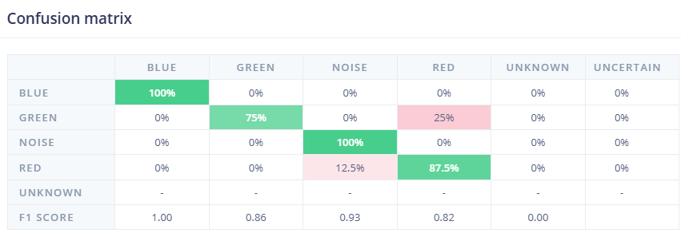

[x] Get all the stats for report study
- [x] Train/val/test split counts per class
Blue 74% / 26% (31s / 11s)
Green 79% / 21% (30s / 8s)
Noise 81% / 19% (30s / 7s)
Red 81% / 19% (34s / 8s)

- [x] DSP block parameters (frame length/stride, # coefficients) — FOUND
Block type: Mel-filterbank energy (MFE)
Frame length: 0.02s
Frame stride: 0.01s
Filter number: 40
FFT length: 256
Low frequency: 0 Hz
High frequency: default (not manually set)
Noise floor: -52 dB
- [x] Model layer count/parameter count — FOUND
Architecture: 1D CNN
Input: 3,960 features → reshaped to 40 columns
Layer 1: Conv1D, 8 filters, kernel size 3
Dropout (0.25)
Layer 2: Conv1D, 16 filters, kernel size 3
Dropout (0.25)
Flatten
Output: 5 classes (softmax)
Exact parameter count: NOT SHOWN on this page — check training output log (Keras 
summary printed before epoch progress) for the "Total params" line
- [x] Final validation accuracy — FOUND: 91.18%
- [ ] Final training accuracy/loss — NOT YET FOUND
- [x] Training time — FOUND 2m 6s
- [ ] Exact tensor arena size (bytes) — NOT YET FOUND (check EI deployment page or Arduino serial output)
- [x] Quantization status (INT8 or float32) — FOUND
Quantized INT8
- [x] Known confusion pattern — FOUND: green→red confusion (~25%)
- [x] Full per-class precision/recall/F1 — FOUND (pull from EI Model Testing page)
Weighted average Precision 	0.92
Weighted average Recall 	0.91
Weighted average F1 score 	0.91
- [x] Full confusion matrix (all classes) — FOUND

- [x] Model size (flash) — FOUND: 32.6 KB
- [x] RAM usage — FOUND: 19.8 KB
- [x] Total inference latency — FOUND: 259 ms
- [x] DSP latency — FOUND: 51 ms
- [x] Classification latency — FOUND: 19 ms
- [x] Latency reconciliation — FOUND (51ms + 19ms = 70ms; the remaining ~189ms of the 259ms total is unaccounted for — needs explanation, audio buffer wait time)
- [ ] Baseline comparison numbers — NOT YET FOUND (need to pick and run a baseline: random-guess 20%, amplitude-threshold heuristic, or lab-assignment model)

[x] Report Outline
[] Complete Report 
[x] Complete README